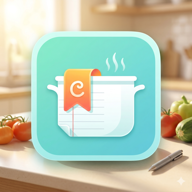

# 俺の自炊

杉本の自炊記録サイト。食材でフィルタリングできるレシピ集。

🔗 **URL**: https://cooking.kaisugi.me/

<p align="center">
  
</p>

## 技術スタック

- **Astro 4.0** - 静的サイトジェネレーター
- **TypeScript** - 型安全性
- **Preact** - 軽量UIライブラリ（3KB）
- **Tailwind CSS** - ユーティリティファーストCSS
- **Cloudflare Pages** - ホスティングと GitHub 連携による自動デプロイ

## 主な機能

- ✅ 食材による複数選択フィルター（AND条件）
- ✅ ページロード時のランダム表示
- ✅ カテゴリ表示（うどん、パスタ、スープなど）
- ✅ レスポンシブデザイン（モバイル対応）
- ✅ アクセシビリティ対応（キーボード操作可能）
- ✅ kaisugi.me風のモダンなデザイン
- ✅ PWA対応（ホーム画面に追加してアプリとして使用可能）

## 開発環境のセットアップ

```bash
# 依存関係のインストール
yarn install

# 開発サーバーの起動
yarn dev
# → http://localhost:4321/

# プロダクションビルド
yarn build

# ビルドのプレビュー
yarn preview
```

## デプロイ

Cloudflare Pages で GitHub リポジトリ `kaisugi/cooking` を接続します。

| 項目 | 設定値 |
| --- | --- |
| Production branch | `main` |
| Build command | `yarn build` |
| Build output directory | `dist` |
| Root directory | `/` |
| Environment variables | `NODE_VERSION=20`, `YARN_VERSION=1.22.22` |

最初のデプロイ後、Pages プロジェクトの **Custom domains** から
`cooking.kaisugi.me` を追加します。`kaisugi.me` の DNS が Cloudflare 管理なら
CNAME レコードは自動作成されます。外部 DNS の場合は、`cooking` の CNAME を
発行された `<project>.pages.dev` に向けます。DNS レコードの追加だけではなく、
Pages 側へのドメイン登録も必要です。

以後、`main` ブランチへの push で自動デプロイされます。

```bash
git add .
git commit -m "Update recipes"
git push
```

GitHub Pages の旧サイトは Cloudflare Pages の表示確認後に公開停止するか、
旧 URL から新 URL へ誘導するページに切り替えます。GitHub Pages 用の
GitHub Actions ワークフローは削除済みです。

## レシピの追加方法

`src/data/recipes.ts`の`recipes`配列に追加：

```typescript
{
  "name": "料理名",
  "url": "https://example.com/recipe",
  "ingredients": ["食材1", "食材2", "食材3"],
  "category": "カテゴリ"
}
```

詳細は [CLAUDE.md](./CLAUDE.md) を参照。

## プロジェクト構成

```
src/
├── components/     # Astro & Preactコンポーネント
├── layouts/        # レイアウト
├── pages/          # ページ
├── data/           # レシピデータ
├── types/          # TypeScript型定義
└── utils/          # ユーティリティ関数
```

## ライセンス

Private project
